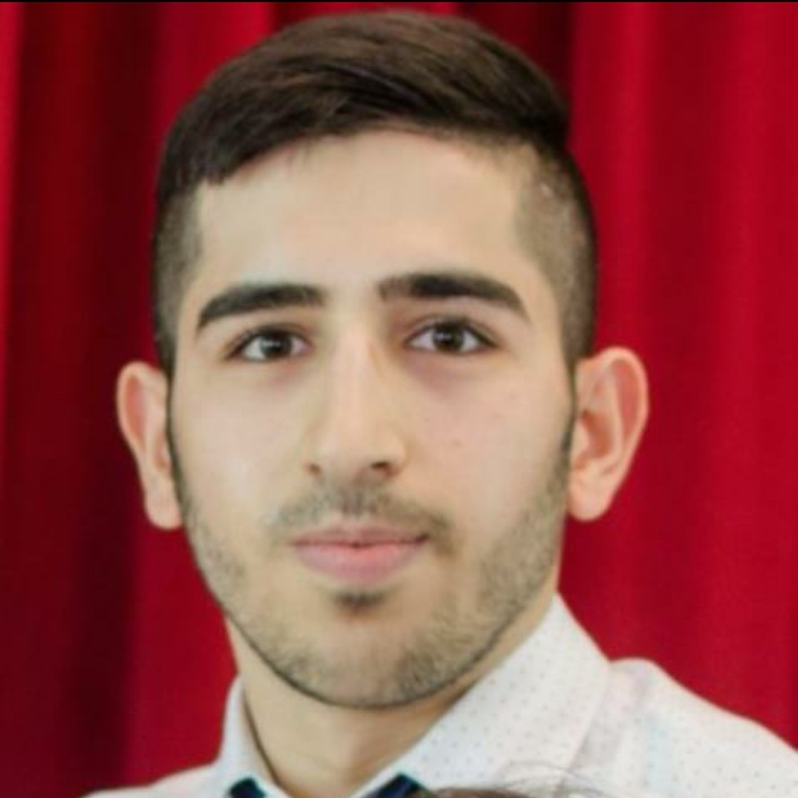

# Ojeen's User Page 

## About

---

My name is *Ojeen Gammah* 

I am a senior at UCSD and expected to graduate next Fall with a B.S in **Computer science**. 

My interest lies in ***AI*** as well as ***autonomous vehicles***. However, I am open to any area within the computer science field. 

>I am most familiar with C++/Python/Java. 

[My favorite programming language is listed here](#ordered-lists)

I am currently learning:

- Design and Analysis of Algorithms
- Data Science
- Version Control
- Test Harness 
- Agile Methods

In my extra time, I like to play tennis and soccer. 

**System.out.println("Hello, World!");** 

## Links
---
This is the link to my [linkedin](https://www.linkedin.com/in/ojeengammah/)

## Image
---

>Here is a picture of me:

## Ordered Lists

---

Here are my favorite programming languages in order

1. Java
2. Python
3. C++

## Task Lists

---
- [x] Develop a routine and stick to it.
- [x] Create a large visual to do list
- [x] Designing
- [x] Implementing 
- [x] Programming
- [x] Problem Solving 

